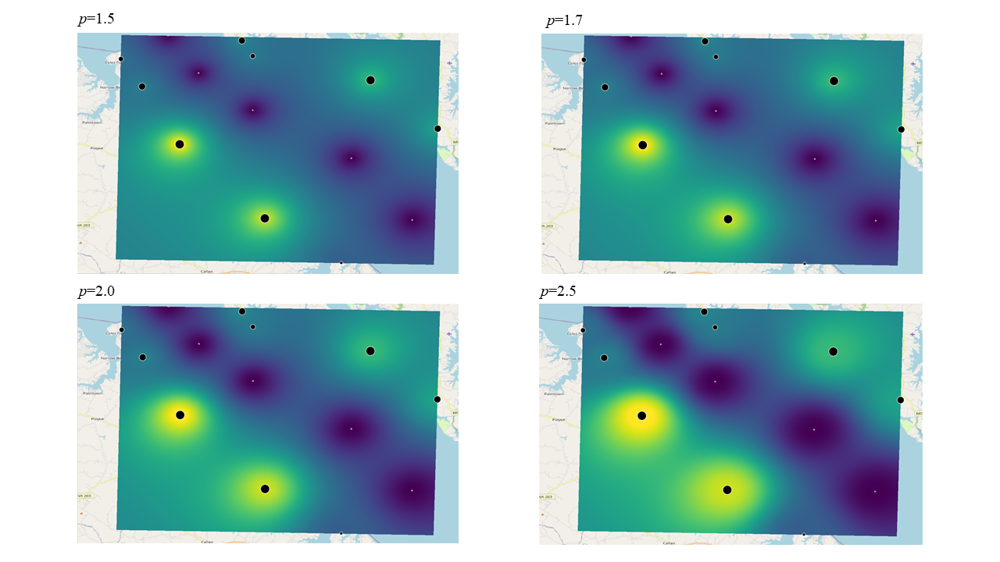
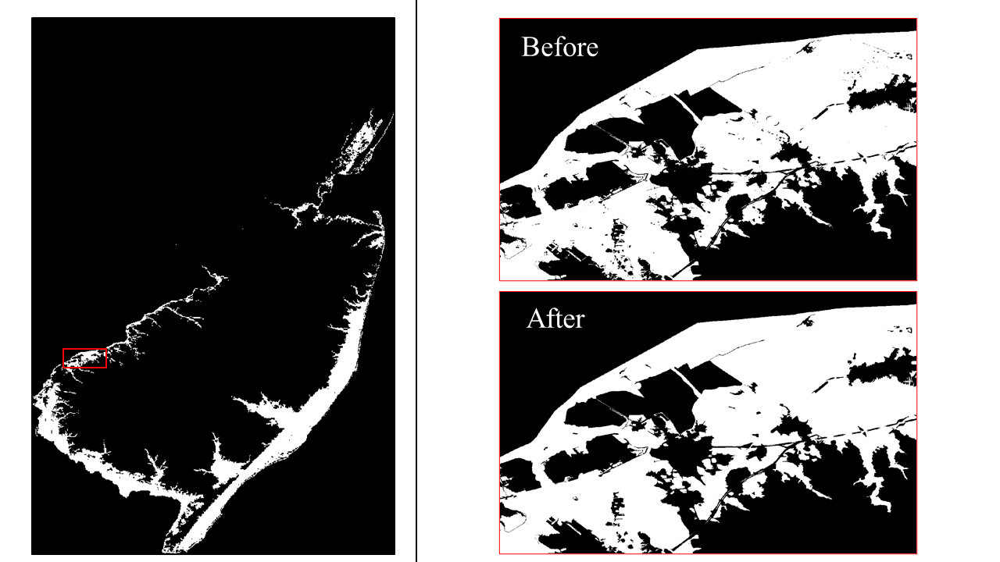

# v2r
Vector to Raster Interpolation Routines 

# Features
v2r contains two algorithms with an associated testing suite.

- Inverse Distance Weighting (IDW)
- Cleaner 
## IDW

 
The interpolation becomes more drastic as _p_ increases.

### **Equation**  
$z_p= \frac{\displaystyle\sum_{i=1}^{n} (\frac {z_i}{d_i^p}) } {\displaystyle\sum_{i=1}^{n} (\frac {1}{d_i^p})}$
 

**Read from txt file**  
`./v2r idw -f [FILEPATH]`

**Read from geopackage**  
`./v2r idw -f [FILEPATH] -g --layer [LAYERNAME] --field [FIELDNAME]`

**Default usage for one exponent**  
`./v2r idw -f [FILEPATH] -g --layer [LAYERNAME] --field [FIELDNAME] --es [EXPONENT]`

**Usage for range of exponents**  
`./v2r idw -f [FILEPATH] -g --layer [LAYERNAME] --field [FIELDNAME] --es [START] --ee [END] --ei [INCREMENT]`

**Flags** 
| Shorthand | Full Name     | Type   | Default                          | Description |
| --------- | ------------- | ------ | -------------------------------- | ----------- |
| -c        | --concurrent  | bool   | _false_                          | Run concurrently? |
|           | --cx          | int    | _200_                            | Set chunk size in x-direction  |
|           | --cy          | int    | _200_                            | Set chunk size in y-direction  |
|           | --ee          | float  |                                  | Set end for exponent (exclusive) |
|           | --ei          | float  | _1.5_                            | Set exponential increment for calculations between start and end  |
|           | --epsg        | int    | _2284_                           | Set EPSG |
|           | --es          | float  | _0.5_                            | Set start for exponent (inclusive)  |
|           | --excel       | bool   | _false_                          | Perform an additional write to excel spreadsheet? |
|           | --field       | string |                                  | Set name of field in geopackage file  |
| -f        | --file        | string | _required_                       | File to run |
| -g        | --gpkg        | bool   | _false_                          | Read from gpkg (true) or txt file (false)?  |
|           | --layer       | string |                                  | Set name of layer in geopackage file  |
|           | --outPath     | string | _data/idw_                       | Set outfile directory  |
|           | --sx          | float  | _100.0_                          | Set step size in x-direction |
|           | --sy          | float  | _100.0_                          | Set step size in y-direction |

**Notes**
- txt file input requires special formatting (example [idw_in.txt](features/idw/idw_test_files/idw_in.txt))
- cx, cy only used if --concurrent=true
- invalid chunk sizes are converted to 1/4 of respective direction (~16 subprocesses)
- epsg only used if --gpkg=false
- field, layer required if --gpkg=true 
- not recommended to run ascii or excel prints for large datasets

## Cleaner

This program cleans islands (dry spots) and voids (wet spots) that do not meet the tolerance thresholds.

**Usage** 
`./v2r clean -f [FILEPATH]`

**Flags** 
| Shorthand | Full Name     | Type   | Default      | Description |
| --------- | ------------- | ------ | --------     | ----------- |
| -a        | --adjacent    | int    | _8_          | Set adjacency type to include ordinal directions  [4 \| 8] |
| -c        | --concurrent  | bool   | _false_      | Run concurrently? |
|           | --cx          | int    | _2560_       | Set chunk size in x-direction  |
|           | --cy          | int    | _2560_       | Set chunk size in y-direction  |
| -f        | --file        | string | _required_   | File to run |
|           | --ti          | float  | _40,000.0_   | Set tolerance level for islands (sq. footage)|
|           | --tv          | float  | _22,500.0_   | Set tolerance level for voids (sq. footage)|

**Notes**
- monitor memory usage (process can use up to 80% of free memory)
- cx, cy only used if --concurrent=true
- cx, cy number of columns, rows to partition file into for subprocess calculations
- invalid chunk sizes are converted to 1/4 of respective direction (~16 subprocesses)

# Testing Suite
**Usage**  
`go test ./...`

**Run Specific Test**  
`go test ./features/idw`

**Test Locations**  
- features/idw
    - subtest name: "{ Serial | Conc }_step{ 1-1 | 2-2 }"
- features/cleaner
    - subtest name: "{ Serial | Conc }_T{ 4 | 9 }_A{ 4 | 8 }"
    - "T" is for tolerance island threshold
    - "A" is for adjacency type
- tools/processing
    - subtest name: "{ data | proj | xInfo | yInfo }"
    - tests geopackage reader

**Notes**  
- outputs ascii files to compare against correct outputs

# Logging
By default, logs are sent to Stdout at the INFO level. 

**Flags**
| Shorthand | Full Name | Type | Default   | Description |
| --------- | --------- | ---- | --------- | ----------- |
| -d        | --debug   | bool | _false_   | Set logging level to DEBUG |
| -e        | --error   | bool | _false_   | Set logging level to ERROR |
| -l        | --log     | bool | _false_   | Log outputs to separate file |

**Notes**
- output logs written to _logs/_
- sample log filename: _2022-24-06_22:06:25.txt_
- if -d or -e are not passed, level=INFO used